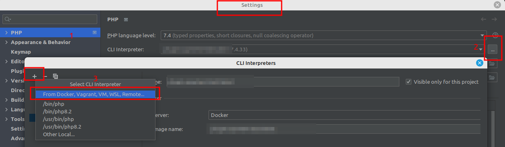
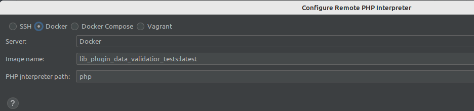
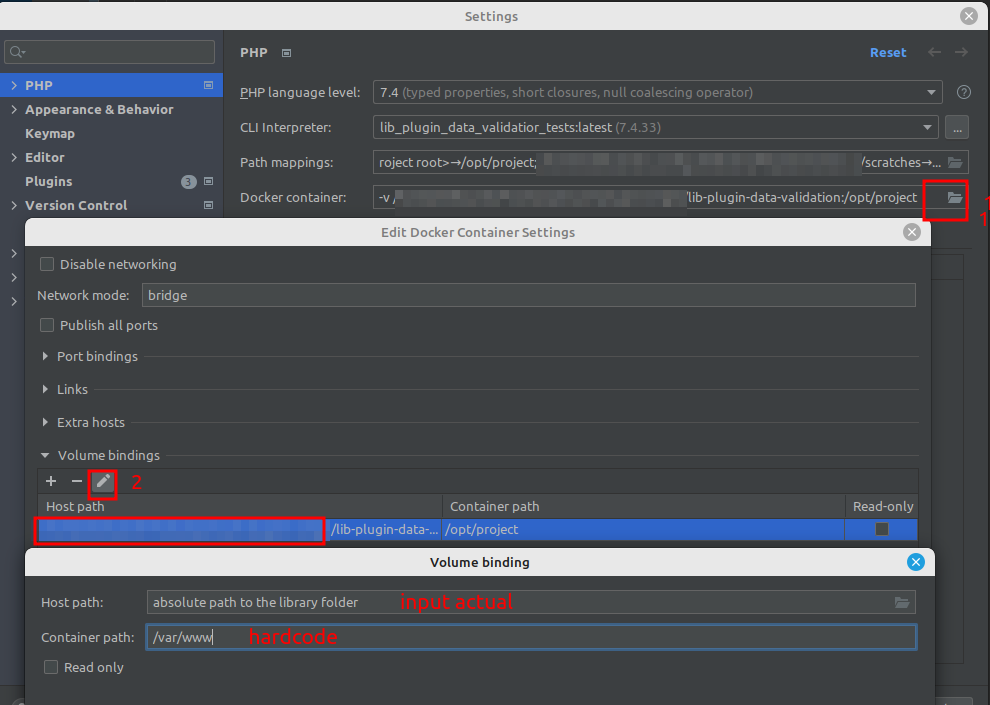
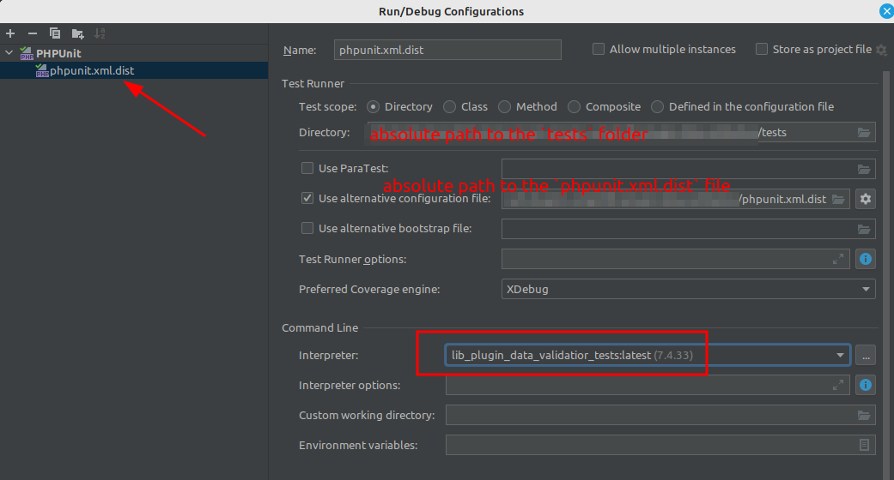
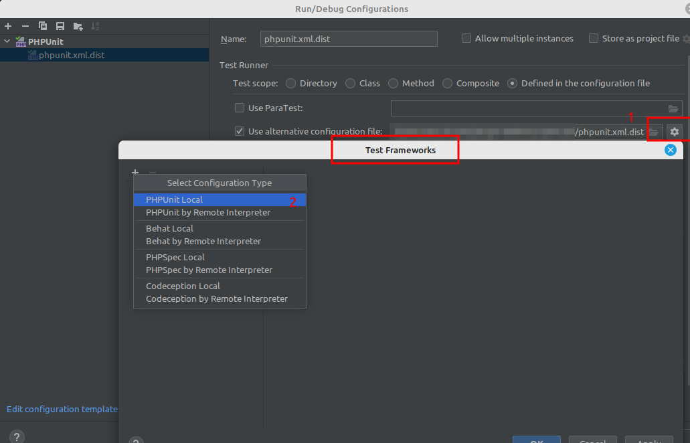
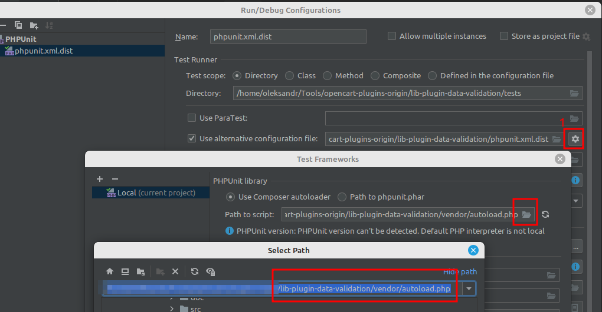

# Data Validator

This library is crafted for validating array-type input data, making it ideal for validating form submissions 
and similar tasks. 

We've drawn inspiration from a [particular library](https://github.com/pdscopes/php-form-validator),
but due to specific requirements, we couldn't 
integrate it directly. Hence, this package represents a tailored version tailored to suit our specific needs.

Not entire code of the original library was taken for this package. That's why the package does not contain many 
useful validation rules and code that handle them. Feel free to copy and adapt absent code if you need.

# Basic usage
```php
namespace '...';

use Paysera\DataValidator\Validator\AbstractValidator;

class SomeValidator extends AbstractValidator
{
    public function __construct(RepositoryInterface $repository /* dependencies here */)
    {
        parent::__construct();

        $rule = new EntityExists($repository);
        $this->addRule($rule);
        $this->setRuleMessage($rule->getName(), 'error message for entity-exists rule');
        
        // for customisation of error for specific fields
        // you can use kind of MessageRepository here as a dependency
        $this->setAttributeMessage('field_name', 'custom_error_this_field');
    }
}
```

Then:
```php
$someValidator = new SomeValidator(/*dependencies here*/);

$rules = [
    'field1' => 'entity-exists|other_rules:with_parameters',
];

if (!$someValidator->validate($this->request->post /* or any other array with data */)) {
    $errors = $someValidator->getProcessedErrors();
}

/*
 * 'field' => [
 *     'entity-exists' => 'error message for entity-exists validator rule',
 *     'other_rules' => 'error message for other rules',
 * ]
 */
```

You can use placeholders for messages:
```php
$this->setRuleMessage('entity-exists', 'Order status with ID=:id must exist');
// or
$this->setAttributeMessage('specific_field', 'Order status with ID=:id must exist');
```
In this case, the placeholder will be replaced by the value of the field being checked

## Adding new Validation Rules
You have to create new class with CamelCase rule name ('entity-exists' => EntityExists)

You have to set the `$name` property, override the `__construct` method if you need some specific dependencies
and then implement the `validate` method (because it is the abstract one).

Investigate the `EntityExists` class and the `AbstractValidatorTest` test as an examples of rules and their usage.

As mentioned above, you can take the code from the original library and use it here by adapting it.
In particular, the validation rules code. Actually, it is strongly recommend to do in such way.

# Testing
```
bash run_tests.sh
```

or manually:
```
docker build -t lib_plugin_data_validatior_tests -f $PWD/Dockerfile $PWD
docker run -it -v $PWD:/var/www -w /var/www lib_plugin_data_validatior_tests composer i
docker run -it -v $PWD:/var/www -w /var/www lib_plugin_data_validatior_tests composer run phpunit
```

# Tests debugging
After building the `lib_plugin_data_validatior_tests` container you can use it for running and debugging tests under IDE

## Setting debugging in the PHPStorm under Ubuntu example:

### Create an interpreter





### Configure the interpreter and files mapping


### Create an endpoint for running tests


### Add a test framework



## Enjoy!